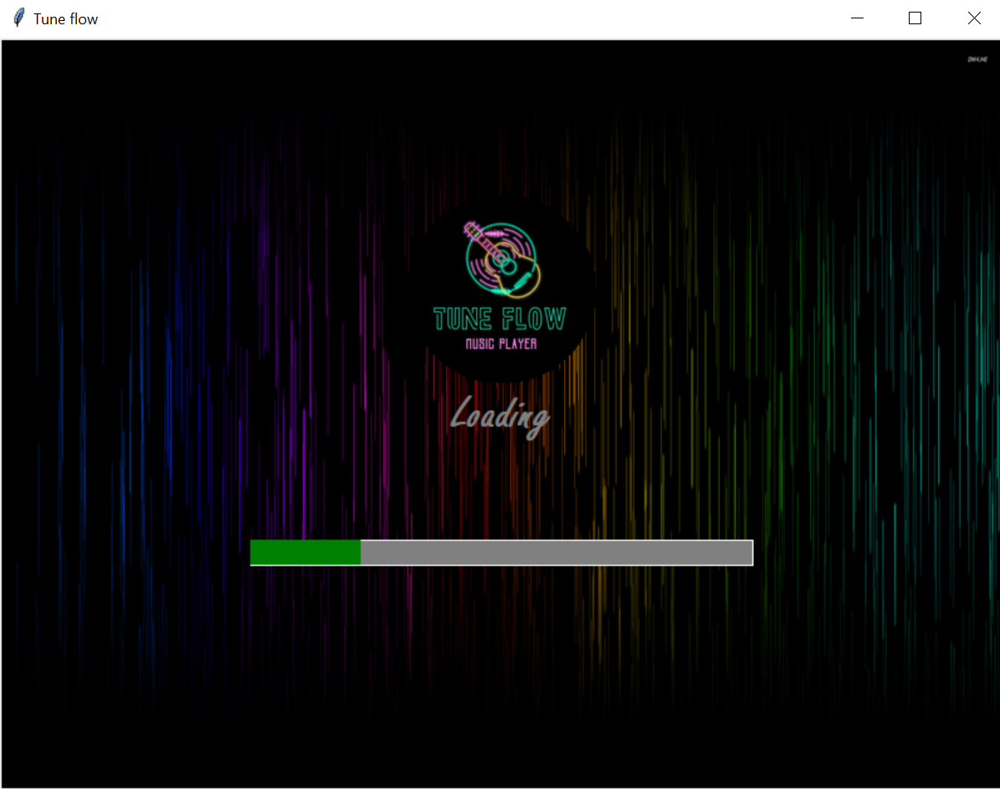
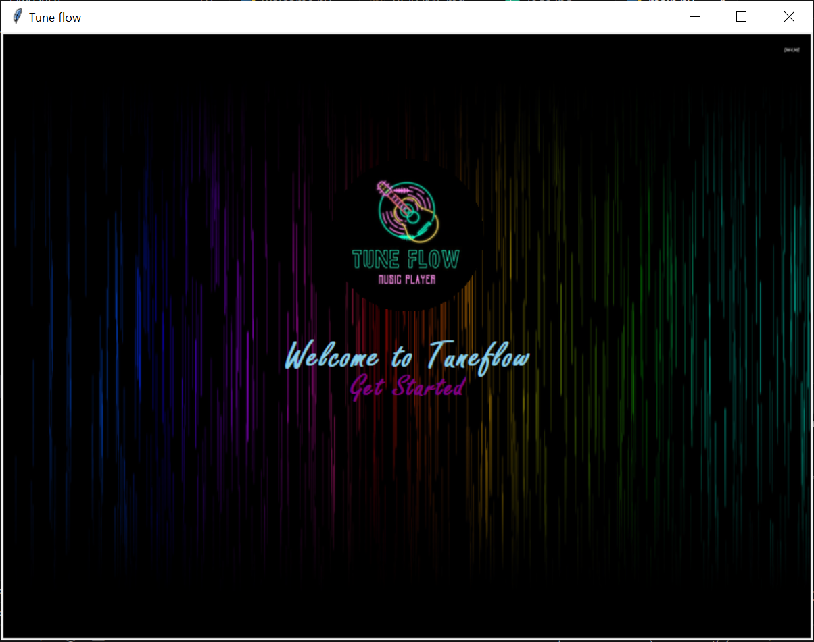
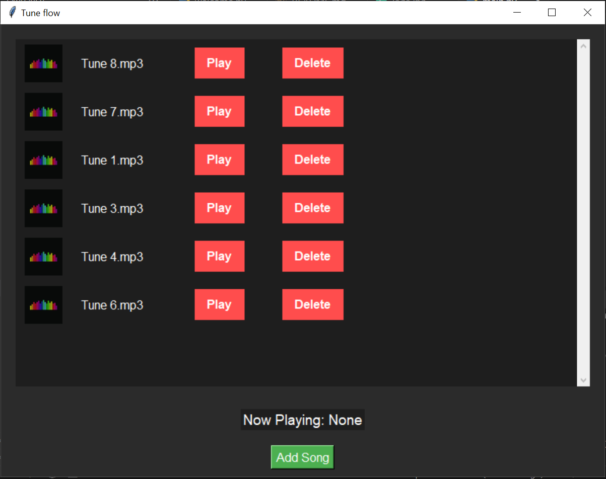
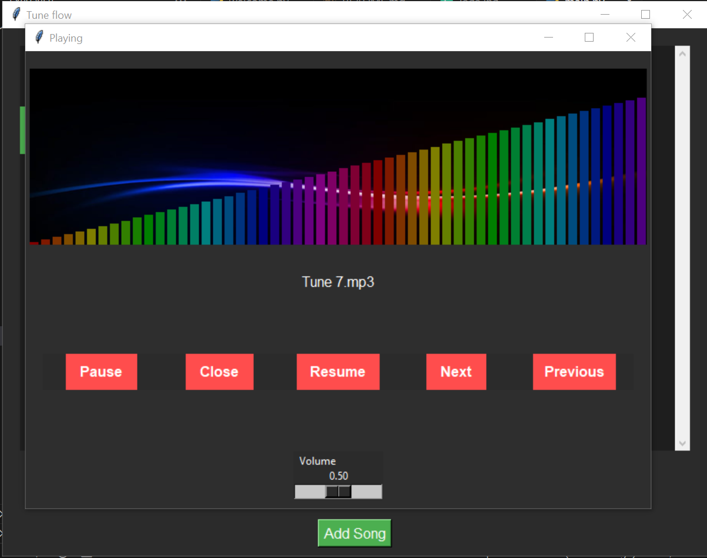

# 🎶 TuneFlow – Music Player with Beat Visualization  

## 📌 Overview  
**TuneFlow** is a Python-based GUI Music Player built with `Tkinter` and `Pygame`.  
It allows you to play MP3 songs with an interactive **beat visualization**, along with an **animated welcome screen** and modern playback controls.  

## ✨ Features  
- 🎼 **Play, Pause, Resume, Stop** music playback.  
- ⏮️ **Next / Previous** track navigation.  
- 🗑️ **Add & Delete** songs dynamically.  
- 📂 **Persistent Song List** – keeps track of your saved songs.  
- 🎶 **Beat Visualization** with colorful rainbow bars.  
- 🖼️ **Custom Welcome Page** with loading animation, circular logo, and button click sound.  
- 🔊 **Volume Control Slider**.  
- 🎨 **Dark-Themed Modern UI**.  

## 🛠️ Requirements  
Make sure you have Python **3.8+** installed.  

Install the required libraries:  
pip install pygame pillow numpy pydub

## 📂 Project Structure  
TuneFlow/  
│── images/   
│ ├── main_logo.jpg  
│ ├── main_img.jpg  
│ ├── logo.jpg  
│ └── img.jpg  
│ └── load_img.png  
│ └── welcome_img.png  
│ └── song_img.png  
│ └── play_img.png  
│── songs/  
│ └── (your mp3 files here)  
│── welcome.py  
│── main.py  
│── song_list.txt  
│── README.md

## ▶️ How to Run  
1. Clone or download this repository.  
2. Install the required dependencies.  
3. Run the application:  
python main.py

## 🎮 Controls  
- **Add Song** → Select MP3 files from file dialog.  
- **Play** → Start playback.  
- **Pause / Resume** → Control music playback.  
- **Next / Previous** → Switch songs.  
- **Delete** → Remove selected song from the list.  
- **Close** → Stop music and close the player.  
- **Volume Slider** → Adjust the playback volume.  

## 📸 Screenshots

## 🤝 Contributing
Pull requests are welcome! For major changes, please open an issue first  
to discuss what you would like to change.
